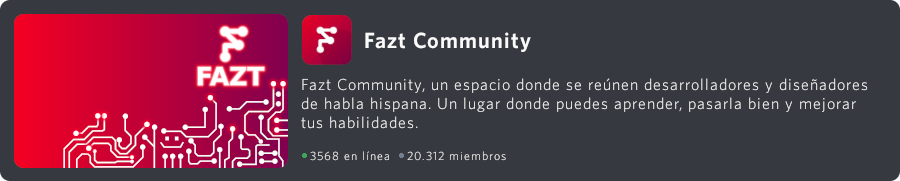

# Bienvenida

¡Hey coders! les damos la bienvenida a Fazt Community, un espacio donde se reúnen desarrolladores y diseñadores de habla hispana. Un lugar donde puedes aprender, pasarla bien y mejorar tus habilidades.

## Introducción a Fazt Community Docs

Los Fazt Community Docs te ayudarán en el camino de colaborar en nuestros proyectos. Podrás aprender las metodologías utilizadas en cada proyecto, las habilidades que debes tener y aprender a como colaborar en cada uno de ellos.

## Primer Vistazo

> - 🚀 [¿Qué es Fazt Community?](#qué-es-fazt-community)
> - 📒 [¿En qué te ayuda Fazt Community?](#en-qué-te-ayuda-fazt-community)
> - 🛠 [¿Cómo contribuir?](#cómo-contribuir)
> - 👥 [Staff](#staff)
> - 🪧 [Comunidad en discord](#comunidad-en-discord)
> - 📏 [Reglas](#reglas)
> - 📜 [Manual de uso](#manual-de-uso)

## ¿Qué es Fazt Community?

Es un grupo de desarrolladores dedicados a la programación y a la creación de proyectos comunitarios.<br>
Parte desde la iniciativa del mismo Fazt para todo aquel que desee crear o aportar a algún proyecto, enseñar y/o aprender de la misma forma.

## ¿En qué te ayuda Fazt Community?

Aquí puedes crecer como profesional, enseñar a otros y compartir tus habilidades con colaboradores de todo el mundo.<br>
Al unirte, podrás conectar con profesionales en el sector del desarrollo de software, aprender a crecer tu portafolio de proyecto y encontrar nuevas posibilidades de empleo.

## ¿Cómo contribuir?

El centro de la comunidad se encuentra en nuestro servidor de Discord, si quieres trabajar con la comunidad y tener mejor comunicación, puedes ingresar al servidor [Discord](https://discord.gg/rg3fKr6) y consultar sobre los proyectos comunitarios y con gusto se les dará el alcance.

Puedes contribuir en la comunidad como programador o diseñador, tenemos repositorios públicos abiertos a la contribución, además, puedes ayudar contestando las dudas de otros usuarios en los canales del servidor. Crea infografías para publicar en distintas redes sociales, puedes coordinar con otros expertos en el área para complementar la información. 

Periódicamente realizamos retos y talleres que cualquiera puede organizar e impartir. Consulta con los miembros del staff por el cronograma. <br>
Los eventos son grabados y subidos posteriormente a youtube para que estén al alcance de todos. 

Hay muchas actividades divertidas, interesantes e incluso profesionales.<br>
Propón la tuya a cualquier miembro del staff o coloca un issue en este repositorio.

Si contribuyes en github, crea un fork del repositorio y realiza un pull request, nuestros administradores revisarán las peticiones para una pronta evaluación en los cambios.<br>

## Staff

Administradores de la comunidad:<br>
[Dano](https://github.com/DanoRysJan)<br>
[Fazt](https://github.com/FaztTech)<br>
[Tati](https://github.com/tati1206)<br>

Moderadores de la comunidad:<br>
[Blopa](https://github.com/Blopaa)<br>
[Edixon](https://github.com/EdixonAlberto)<br>
[Elireth](https://github.com/elirethDev)<br>
[Erian](https://github.com/erianvc)<br>
[Lottie](https://github.com/EnzoDiazDev)<br>
[Paolinsky](https://github.com/PaoloTorregroza/)<br>
[Yesniel](https://github.com/YesnielX)

Contribuidores:<br>
Tu

> Para ser parte del staff se debe tener en cuenta el esfuerzo constante hacia la comunidad, las ganas de participar y enseñar, ser de gran ayuda hacia los demás sin pedir o esperar algo a cambio.

# Comunidad en Discord

Plataforma principal de la comunidad en Discord.

[](https://discord.gg/rg3fKr6)

> **Nota:** Si eres nuevo en usar Discord , deberás **verificar** por medio de tu teléfono la autenticación de tu cuenta. Esto es de mucha ayuda para evitar cuentas de dudosa procedencia.

## Reglas

> Como toda comunidad contamos con ciertas reglas que se deben acatar para tener una buena estadía en el server.

Fazt Community extiende del [Código de Conducta](https://www.contributor-covenant.org/es/version/2/0/code_of_conduct/) de [contributor-covenant.org](https://www.contributor-covenant.org/) y de las [Directivas de la comunidad](https://discord.com/guidelines) de [Discord](https://discord.com) y añade:
```md 
1. Nada de insultos, acoso, amenazas, imágenes ofensivas, ataques contra otras personas o contenido NSFW.

2. No comprometer ni vulnerar la identidad de los usuarios.

3. El idioma oficial de este servidor es el español o castellano, al ser el idioma más extendido de Latinoamérica y España.

4. No se permite publicar contenido ilegal o falsificado como malware, piratería de software, libros o vídeos.

5. No se tolera el spam (autopromoción, mensajes fuera de lugar y flood) fuera de los canales donde esté permitido compartir contenido. Puedes compartir enlaces a cosas que hayas hecho en #compartir, o en #cafetería si el contexto lo amerita. No compartas enlaces de referidos o similares.

6. No hagas flood, organiza tus ideas en un único mensaje y no lo repitas múltiples veces en el mismo o distintos canales. 

7. No uses canales para lo que no son, cada canal tiene su descripción explicando para qué se utiliza.

8. No se permite publicar íntegramente el enunciado de un ejercicio, examen o práctica y pedir su resolución.

9. Coloca tu duda directamente, explica de la mejor manera posible tu problema en el canal adecuado. Si no sabes dónde colocarlo, usa #dudas.

10. Pon una triple comilla invertida (`) antes y después del código para monoespaciarlo. No pegues fragmentos de código largos, enlaza a un Gist (https://gist.github.com/) o un Pastebin (https://pastebin.com/).

11. Evita las menciones a roles, usuarios o quotes en la medida de lo posible para no molestar.

12. Presentate profesionalmente en #presentate, haz ofertas de trabajo únicamente en #empleos, y conversa al respecto en #freelances.

13. Un nickname o apodo debe ser legible y empezar por caracteres que permitan una posible mención de una manera sencilla, los moderadores se reservan el derecho de modificar aquellos apodos que consideren inadecuados.

14. Evita las menciones a roles, usuarios o quotes en la medida de lo posible para no molestar.    
```

## Roles

Estos son los roles para todo público:<br>
**Frontend Dev**: Desarrollador frontend<br>
**Backend Dev**: Desarrollador backend<br>
**Diseñador**: Diseñador ui/ux<br>
**Mobile Dev**: Desarrollador de aplicaciones móviles<br>
**DBA**: Administrador de bases de datos<br>
**Devop**: Administrador de sistemas<br>
**QA**: Asegurador de calidad / Tester<br>
**Arquitecto**: Arquitecto y diseñador de sistemas<br>

## Manual de uso

La comunidad está simplificada para fomentar la participación, equivocarse y dudar es humano, por lo que ante cualquier duda, solo consultanos. 

El servidor consta de nueve categorías y aproximadamente cuarenta canales. 

* Fazt Community:<br>
Acá se encuentran los canales de anuncios y bienvenida.<br>
¡Puedes autoasignarte un rol en el canal de bienvenidas!

* Comunidad: <br>
Aquí se encuentran los canales de texto generales; general, cafetería para offtopic, compartir para compartir enlaces y recursos, taberna para discutir temas sensibles de la sociedad (+18) y un canal de voz para charlar con los amigos. 

* Atelier: <br>
En este espacio creativo se llevan a cabo actividades educativas e interactivas; talleres, live coding, challenges y más. 

* Profesional: <br>
Tres canales dedicados a tu crecimiento profesional. <br>
Podés encontrar u ofrecer empleos, presentarte tus habilidades ante la comunidad y discutir cuestiones laborales como freelance.

* Ayuda: <br>
Este es el espacio donde dejas todas tus consultas y ayudas a otros miembros en sus dudas. <br>
Cada canal corresponde a cada uno de los [roles](#roles), pero se encuentran abiertos a cualquier rol. <br>
Estos canales pretenden representar las distintas áreas profesionales en nuestra industria, por lo que abarcan la gran mayoría de las tecnologías, actividades y habilidades. <br>
Si no sabes en qué área corresponde tu duda, dejala directamente en el canal genérico de #dudas.

* Lenguajes: <br>
Encontrarás canales específicos para los lenguajes más populares y consultados. 

* Tecnologías:<br>
Espacios para consultar y discutir sobre librerías, frameworks y tecnologías más populares. 

* Ocio: <br>
Un espacio más offtopic que el canal offtopic, es un espacio abierto a literalmente cualquier actividad no relacionada con la programación y la tecnología. 

* Logs: <br>
Bueno, en algún lugar hay que poner información del servidor... <br>
Utiliza el canal de comandos para jugar con los bots. 

Además, recuerda que los canales y las categorías no son fijas. Pueden cambiar con el tiempo y queremos saber qué opinas al respecto. <br>
Si consideras que es necesario añadir un canal de cualquier tipo, háznoslo saber. 

Muchas gracias por llegar hasta el final. <br>
Esperamos que disfrutes de una de las comunidades más grandes de programación de habla hispana.
