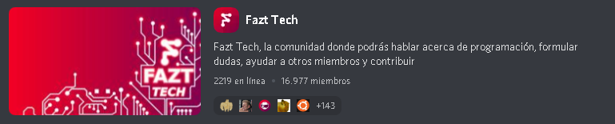

# Bienvenida

Hola les damos la bienvenida a Fazt Community un espacio donde se reúnen desarrolladores y diseñadores de habla hispana. Un lugar donde puedes aprender, pasarla bien y mejorar tus habilidades.

## Introducción a Fazt Community Docs

Los Fazt Community Docs te ayudarán en el camino de colaborar en nuestros proyectos. Podrás aprender las metodologías utilizadas en cada proyecto, las habilidades que debes tener y aprender a como colaborar en cada uno de ellos.

## Primer Vistazo

> - 🚀 [¿Qué es Fazt Community?](#getting-started)
> - 📒 [¿En qué ayuda Fazt Community?](#projects)
> - 🛠 [¿Cómo contribuir?](#supported-frameworks)
> - 🚇 [¿Cómo crear un proyecto para Fazt Community?](#sub-projects)
> - 🏅 [Revisa nuestros proyectos](#badges--presentation-materials)
> - 👥 [Recursos](#community)
> - 👏 [Nuestra Red](#contributing)
> - :memo: [Licencia](#license)

## ¿Qué es Fazt Community?

Es un grupo de desarrolladores dedicados a la programación y a la creación de proyectos comunitarios.
Parte desde la iniciativa del mismo Fazt para todo aquel que desee crear o aportar a algún proyecto, enseñar y/o aprender de la misma forma.

## ¿En qué te ayuda Fazt Community?

Aqui puedes crecer como profesional, enseñar a otros y compartir tus habilidades con colaboradores de todo el mundo.
Al unirte, podrás conectar con profesionales en el sector del desarrollo de software, aprender a crecer tu portafolio de proyecto y encontrar nuevas posibilidades de empleo.

## ¿Cómo contribuir?

Para poder contribuir puede ser de dos formas , tanto trabajar de manera interna en los repositorios o hacer un fork.
Nuestros administradores revisarán los pull request para una pronta aceptación en los cambios.
Recuerda que si quieres trabajar con la comunidad y tener mejor comunicación , puedes ingresar a nuestro [Discord](https://discord.gg/rg3fKr6) y consultar sobre los proyectos comunitarios y con gusto se les dara el alcance.

## Organización

## Commits y Pull Requests

La forma correcta de colaborar en un proyecto de git, es seguir los convenios de desarrollo:

- Basado en el convenio de cerlink

```
feat: (Características nuevas para usuario, no característica para script de compilación)

fix: (Corrección de errores para usuario, no corrección de script de compilación)

docs: (Cambios en la documentación)

style: (Formateo, puntos y comas que hagan falta, etc. sin cambio en código de producción)

refactor: (Código de producción en refactorización)

test: (Agregando pruebas de refactor, endpoints, faltantes, no cambio en código de producción)

chore: (Actualización de tareas, sin cambio en código de producción)

Merge: (Fusión de ramas, cambio en código de producción)

release: (Creación de una nueva version en el proyecto)
```

## ¿Cómo crear un proyecto para Fazt Community?

Si tienes ganas de crear un proyecto dentro de la organizacion puedes consultarlo a los siguientes encargados:

> [leave20](https://github.com/leave20) Leader Project Manager.

> [Tati](https://github.com/tati1206) Leader Project Manager.

Ambos encargados podrán asesorarte en crear tus repositorios dentro de la organizacion.

# Revisa nuestros proyectos core

> - [Fazt API](https://github.com/faztcommunity/fazt-api)
> - [Fazt Web Community](https://github.com/faztcommunity/fazt-oficial-web)
> - [Fazt Methodology](https://github.com/faztcommunity/fazt-methodology-core)
> - [Fazt Bot](https://github.com/faztcommunity/fazt-bot)

# Recursos

>

# Comunidad en Discord

Plataforma principal de la comunidad en Discord.

[](https://discord.gg/rg3fKr6)

> **Nota:** Si eres nuevo en usar Discord , deberás **verificar** por medio de tu telefono la autenticación de tu cuenta. Esto es de mucha ayuda para evitar cuentas de dudosa procedencia.

## Reglas

> Como toda comunidad contamos con ciertas reglas que se deben acatar para tener una buena estadía en el server.

```
1. **Civil** Nada de insultos, amenazas, imágenes ofensivas o ataques contra otras personas. Prohibido conspirar contra los staffs.

2. **Idioma Oficial** El idioma oficial de este servidor es el español o castellano al ser el idioma más extendido de Latinoamérica y España. No messages in English (Except in #no-spanish channel).

3. **Contenido Ilegal** No se permite publicar contenido ilegal como malware, piratería de software, libros o vídeos. No se permite publicar contenido que fuera de Discord ya sea ilegal.

4. **Menciones** Evita las menciones a roles, usuarios o quotes en la medida de lo posible para no molestar.

5. **Líneas de Código** Pon una triple comilla invertida (`)(alt-gr + 96) antes y después del código para monoespaciarlo. No pegues fragmentos de código largos, enlaza a un Gist (https://gist.github.com/) o un Pastebin (https://pastebin.com/).

6. **No Spam** No se tolera el spam fuera de los canales donde esté permitido. Puedes compartir enlaces a cosas que hayas hecho en el canal #yo-lo-hice.

7. **Trabajos** Haz ofertas de trabajo únicamente en #empleos o postúlate como colaborador en #colaboraciones.

8. **Tareas Escolares** No se permite publicar íntegramente el enunciado de un ejercicio, examen o práctica y pedir su resolución.

9. **No pidas ayuda** ~~¿Alguien me ayuda?~~ En vez de eso explica de la mejor manera posible tu problema en el canal adecuado, evitando mandar el mensaje en varías líneas. Si no sabes dónde colocarlo usa #dudas.

10. **Canales** No uses canales para lo que no son, cada canal tiene su descripción explicando para qué se utiliza.

11. **Nickname/Apodo** Un nickname o apodo debe ser legible y empezar por caracteres que permitan una posible mención de una manera sencilla, los moderadores se reservan el derecho de modificar aquellos apodos que consideren inadecuados.

```

## Roles

Estos son los roles para todo publico:

**Dev FullStack:** Desarrollador Fullstack

**Dev Frontend:** Desarrollador Front-end

**Dev Backend:** Desarrollador Back-end

**Dev Mobile:** Desarrollador de aplicaciones móviles

**Dev Games:** Desarrollador de videojuegos

**Dev Bot** Desarrollador de bots

**Taller** Estudiantes de Fazt Tech

**Tester** Probadores de software

## Staff

Este es el cuerpo que vela por toda la comunidad:

> **_Admin_**

> **_Mod_**

> **_Contribuitor_**

**Para ser parte del staff se debe tener en cuenta el esfuerzo constante hacia la comunidad, las ganas de participar y enseñar, ser de gran ayuda hacia los demás sin pedir o esperar algo a cambio.
Dependiendo a dichos factores mencionados se procederá por parte de la administración a evaluar a dichos usuarios para ciertos cargos.**

# Licencia

>
